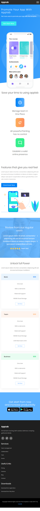
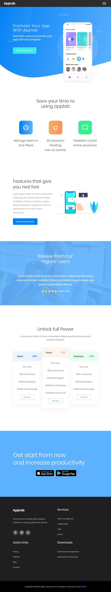
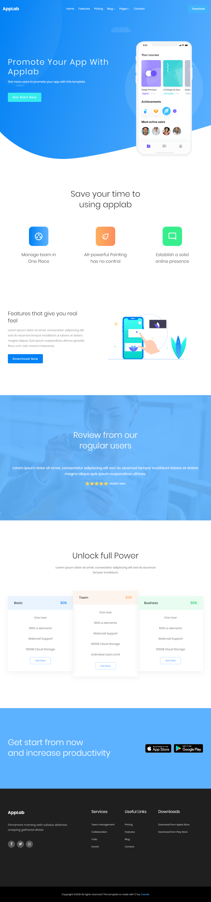

> ⭐ ***README** to coś więcej niż opis. Poprzez nie **pokazujesz swoje mocne strony** – swoją dokładność, sposób myślenia i podejście do rozwiązywania problemów. Niech Twoje README pokaże, że masz **świetne predyspozycje do rozwoju!***
> 
> 🎁 *Zacznij od razu. Skorzystaj z **[szablonu README i wskazówek](https://github.com/devmentor-pl/readme-template)**.* 

 

# HTML & CSS: Responsywność (RWD)

Czas zakodować stronę, która ma przygotowane 3 widoki dla różnych punktów granicznych (ang. breakpoints):

- mobile
- tablet
- desktop.

## Od czego zacząć?

Przeczytaj dokładnie treść, którą zamieszczam poniżej. Następnie zapoznaj się ze zrzutami ekranu prezentującymi poszczególne widoki – znajdziesz je w katalogu `./assets`.

Na każdym widoku zaznacz sobie, które elementy to oddzielne sekcje strony. Zwróć uwagę, jak się one zmieniają podczas przechodzenia z jednego widoku do drugiego. To ułatwi Ci zaplanowanie układu.

Zacznij od **widoku na telefon**. Możesz użyć [PerfectPixela](https://chrome.google.com/webstore/detail/perfectpixel-by-welldonec/dkaagdgjmgdmbnecmcefdhjekcoceebi?hl=pl) – dodatku do przeglądarki Chrome – aby ułatwić sobie kodowanie. Pamiętaj, że nie warto odzwierciedlać projektu 1:1 co do piksela. Masz zaznajomić się z technikami RWD i przy okazji utrwalić wiedzę z HTML-a i CSS-a. Widok ma być podobny do pierwowzoru: zachować koncepcję i estetykę oraz dopasowanie do najważniejszych rozdzielczości. Nie ma być identyczny, a w zasadzie nie może być, ponieważ na każdym urządzeniu z inną rozdzielczością będzie się prezentował trochę inaczej.

Jeśli będziesz korzystać z PerfectPixela, pamiętaj o ustawieniu prawidłowej skali dla podglądu obrazu oraz ustawienia odpowiedniej szerokości dla okna przeglądarki.

Możesz również skorzystać z dodatku [ColorZilla](https://chrome.google.com/webstore/detail/colorzilla/bhlhnicpbhignbdhedgjhgdocnmhomnp), dzięki któremu pobierzesz kolor ze wskazanego miejsca. Wystarczy wyświetlić obraz w przeglądarce Chrome i użyć tego rozszerzenia. 

Kiedy skończysz kodować widok dla telefonu, zajmij się **widokiem tabletowym**. Pamiętaj, aby sprawdzać, czy zmiany wprowadzone do widoku tabletowego nie spowodowały zmian w widoku mobilnym.

Po skończeniu kodowania widoku dla tabletu zajmij się **desktopem**. Ponownie pamiętaj o częstym sprawdzaniu, czy czegoś nie popsułeś w poprzednich wersjach. Im wcześniej się zorientujesz, że coś nie działa, tym łatwiej będzie Ci to naprawić.

## Zasoby

### Fonty

Font wykorzystywany w projekcie to `Poppins`. Znajdziesz go w [Google Fonts](https://fonts.google.com/specimen/Poppins).

### Obrazy

Wszystkie niezbędne obrazy, w tym kształty, znajdziesz w katalogu `./images`. 

### Ikony

Ikony mediów społecznościowych znajdujące się w stopce stwórz przy pomocy [Font Awesome](https://fontawesome.com/).

## Widoki

Nie podaję dokładnych punktów granicznych, abyś sam mógł ocenić, kiedy zrobić przejście.

Zamieszczam tylko informację, dla jakich rozdzielczości był robiony przedstawiony zrzut ekranu:

 - mobile => 600px
 - tablet => 900px
 - desktop => 1200px

### mobile => 600px

### tablet => 900px

### desktop => 1200px

# Zadanie dodatkowe

Najwyższy czas zaprezentować swoje umiejętności znajomym na Facebooku czy Instagramie! Być może właśnie w ten sposób zdobędziesz swoje pierwsze zlecenie – poważnie! Osoby, które Cię znają, są w stanie bardziej zaufać Tobie niż komuś „z ulicy”. Dzięki temu zdobędziesz, tak ważne przy rekrutacji, doświadczenie komercyjne.

## GitHub Pages

GitHub udostępnia funkcjonalność, która nazywa się [GitHub Pages](https://pages.github.com/). W ten sposób możemy „serwować” naszą stronę całkowicie za darmo na podstawie zawartości naszego repozytorium. Możliwość ta dotyczy jedynie stron statycznych korzystających z HTML-a, CSS-a i JavaScriptu – więc również z Reacta. 

Wystarczy, że przejdziesz do [ustawień (Settings) swojego repozytorium](https://docs.github.com/en/pages/getting-started-with-github-pages/configuring-a-publishing-source-for-your-github-pages-site#choosing-a-publishing-source) i wybierzesz gałąź (branch), która zawiera pliki strony (pewnie będzie to `master` lub `main`). Po minucie czy dwóch strona powinna być już dostępna.

Potrzebujesz szczegółowych instrukcji lub Twoja strona nie działa? Poszukaj wskazówek w moim artykule: [GitHub Pages – podgląd projektu na GitHubie](https://devmentor.pl/b/github-pages-podglad-projektu-na-githubie).

> **Uwaga!** Czasami nawet GitHub ma problemy z własnymi serwerami/usługami i coś może nie działać, jak należy. Wtedy wystarczy sprawdzić „status” na [tej stronie](https://www.githubstatus.com/). Tego typu rozwiązanie jest dość powszechne.

## Własna domena

Mile widziana (a już na pewno, gdy znajdziesz klienta) będzie własna domena. Na szczęście GitHub Pages daje możliwość jej podpięcia.

Koszt domeny to zaledwie kilkanaście złotych w pierwszym roku, a jej przedłużenie na kolejny rok to zazwyczaj mniej niż 99 zł (zależnie od końcówki). Taką domenę możesz kupić np. w [seohost.pl](https://seohost.pl/?ref=22965).

> **Uwaga!** Nieuczciwe firmy oferują domeny w bardzo atrakcyjnych cenach za pierwszy rok, ale nadrabiają to kosztem przedłużenia, które musisz wykonać, jeśli chcesz zatrzymać domenę. Przeczytaj dokładnie regulamin, zanim dokonasz zakupu.

Domena to nazwa wskazująca na konkretny serwer, na którym znajdują się pliki naszej strony internetowej. Wskazanie to jest realizowane przez [DNS](https://pl.wikipedia.org/wiki/Domain_Name_System).

Jak przeczytamy w [dokumentacji GitHub Pages](https://docs.github.com/en/pages/configuring-a-custom-domain-for-your-github-pages-site/managing-a-custom-domain-for-your-github-pages-site#configuring-a-subdomain), możemy użyć [domeny](https://docs.github.com/en/pages/configuring-a-custom-domain-for-your-github-pages-site/managing-a-custom-domain-for-your-github-pages-site#configuring-an-apex-domain) lub [subdomeny](https://docs.github.com/en/pages/configuring-a-custom-domain-for-your-github-pages-site/managing-a-custom-domain-for-your-github-pages-site#configuring-a-subdomain) (jeśli kupimy np. domenę devmentor.pl, to jej subdomeną będzie np. rwd.devmentor.pl). Aby to zrobić, musimy dodać odpowiedni rekord w ustawieniach DNS. Sposób wykonania tego zadania zależy od dostawcy domeny i jego panelu administracyjnego. W seohost możesz to zrobić w [taki sposób](https://seohost.pl/pomoc/konfiguracja-rekordow-dns-domeny). Jeśli sobie nie poradzisz, to support (pomoc techniczna) na pewno Ci pomoże. Zawsze byli dla mnie pomocni.

> **Uwaga!** Dokonanie zmian w DNS (propagacja informacji) może trwać nawet 24 h (często jednak strona działa już po paru godzinach), dlatego wygodnie jest to robić wieczorem, aby rano mieć już sprawę załatwioną.

# Prawa autorskie

Wszelkie prawa autorskie oraz pokrewne do szablonu i elementów wchodzacych w jego skład należą do [colorlib.com](https://colorlib.com).
Szablon i jego elementy mogą być wykorzystywane na zasadach zgodnych z [licencją](https://colorlib.com/wp/licence/).

 

> ⭐ ***README** to coś więcej niż opis. Poprzez nie **pokazujesz swoje mocne strony** – swoją dokładność, sposób myślenia i podejście do rozwiązywania problemów. Niech Twoje README pokaże, że masz **świetne predyspozycje do rozwoju!***
> 
> 🎁 *Zacznij od razu. Skorzystaj z **[szablonu README i wskazówek](https://github.com/devmentor-pl/readme-template)**.* 
